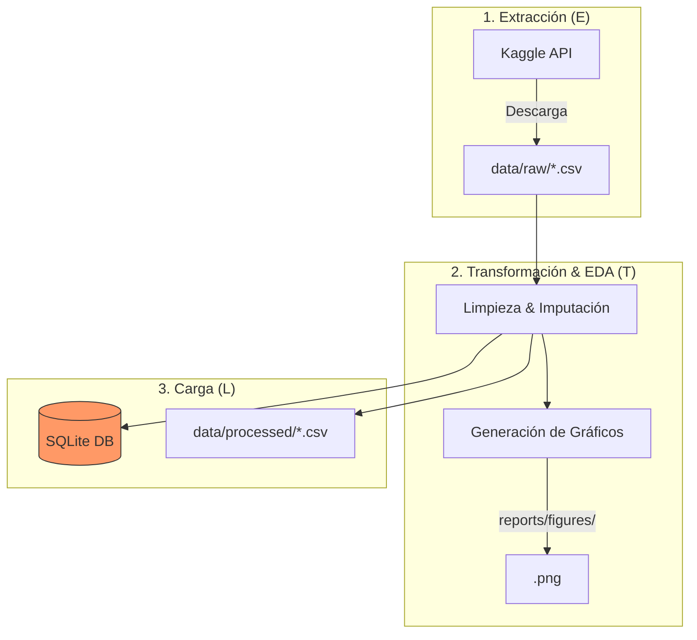

# 📊 SaleSight – Retail Data Engineering

<a target="_blank" href="https://cookiecutter-data-science.drivendata.org/">
    
</a>

**SaleSight** es un ecosistema de ingeniería de datos para el procesamiento de transacciones retail. Su arquitectura ETL está diseñada para limpiar y normalizar grandes volúmenes de datos, sirviendo como base para futuros modelos de **Segmentación RFM** y **Predicción de Churn (Fuga)**.

---

## 🏗️ Arquitectura del Pipeline (ETL)

El sistema automatiza la descarga desde Kaggle, la limpieza estadística y la persistencia en bases de datos estructuradas.



---

## 🚀 Ejecución del Proyecto

Este proyecto utiliza `uv` para la gestión de dependencias y ejecución determinista.

### 1. Configuración Inicial
```bash
# Sincronizar el entorno virtual y dependencias
make requirements
```

### 2. Ejecutar Pipeline
Puedes ejecutar el proceso completo o por fases utilizando el argumento `--modo`:

*   **Pipeline Completo:**
    ```bash
    uv run python -m salesight.pipeline.main --modo completo
    ```
*   **Por Fases:**
    ```bash
    uv run python -m salesight.pipeline.main --modo ingesta
    uv run python -m salesight.pipeline.main --modo transformacion
    uv run python -m salesight.pipeline.main --modo carga
    ```

---

## 📂 Organización del Proyecto

```text
├── data/              <- Almacenamiento de datos (raw, processed)
├── reports/figures/   <- Gráficos de tendencia, perfiles y ventas
├── salesight/         <- Módulos principales (ingest, features, plots)
│   ├── pipeline/      <- Orquestador central del ETL
│   └── modeling/      <- Scaffolds para modelos RFM y Churn
├── Makefile           <- Comandos rápidos (data, eda, lint, test)
└── pyproject.toml     <- Configuración y dependencias del proyecto
```

---

## 🎯 Hoja de Ruta
*   [x] Ingestión automatizada (Kaggle API).
*   [x] Limpieza e imputación de valores faltantes.
*   [x] Generación de reportes visuales (EDA).
*   [ ] Implementación de Segmentación RFM.
*   [ ] Modelo predictivo de Fuga de Clientes (Churn).

---
*Desarrollado por Josue Ribero Duarte & Stiven Posada Casadiego.*
