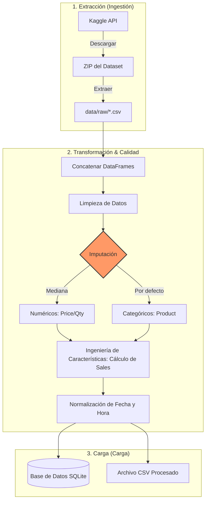
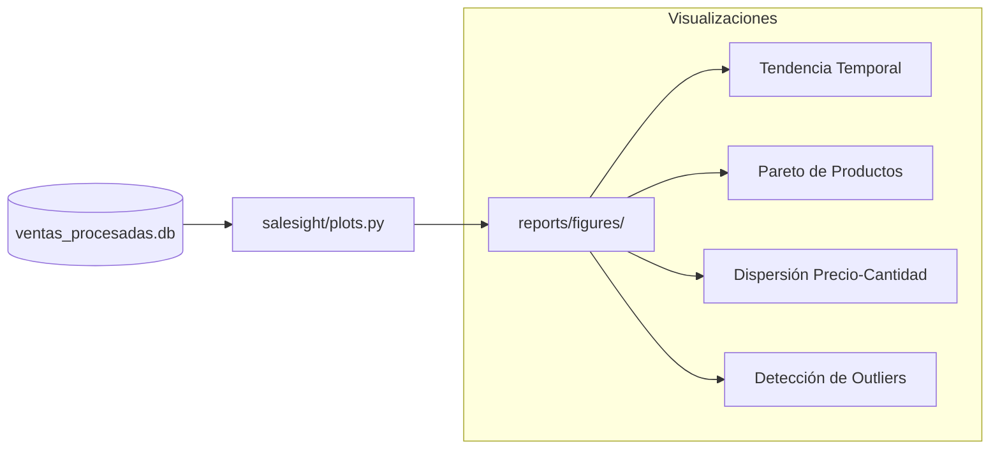

# 📊 SaleSight – Pipeline de Ventas con ML

<a target="_blank" href="https://cookiecutter-data-science.drivendata.org/">
    
</a>

SaleSight es un proyecto de ingeniería de datos y ciencia de datos diseñado para procesar grandes volúmenes de transacciones de ventas, realizar análisis exploratorios automatizados y preparar los datos para modelos predictivos. El sistema está construido bajo principios de **reproducibilidad**, **automatización** y **calidad de datos**.

---

## 🏗️ Arquitectura del Pipeline (ETL)

El proceso ETL está modularizado para garantizar que cada etapa sea independiente y auditable. Se utiliza `loguru` para el monitoreo y `typer` para la ejecución vía interfaz de línea de comandos (CLI).



---

## 📈 Flujo de Análisis Exploratorio (EDA)

El análisis exploratorio se genera de forma asíncrona a partir de la base de datos procesada, permitiendo una visualización rápida de la salud del negocio y los datos.



---

## 🚀 Cómo Ejecutar el Proyecto

Este proyecto está diseñado para ejecutarse completamente desde la terminal, cumpliendo con los estándares de producción de ingeniería de datos.

### 1. Configuración del Entorno
```bash
# Crear y activar entorno virtual
python -m venv entorno
source entorno/bin/activate  # En Linux/macOS
# entorno\Scripts\activate   # En Windows

# Instalar dependencias
pip install -r requirements.txt
```

### 2. Ejecutar Pipeline de Datos (ETL)
Puedes ejecutar el proceso completo (Ingesta + Transformación + Carga):
```bash
make data
# O directamente con python:
python -m salesight.pipeline.main --mode full
```

### 3. Generar Reportes Visuales (EDA)
```bash
make eda
# O directamente con python:
python -m salesight.plots
```

---

## 📂 Organización del Proyecto

```text
├── Makefile           <- Comandos de automatización (make data, make eda)
├── data
│   ├── raw            <- Datos originales (inmutables)
│   ├── processed      <- Datos limpios e imputados para modelado
├── reports
│   └── figures        <- Gráficos generados automáticamente
├── salesight          <- Código fuente (Módulos Python)
│   ├── ingest.py      <- Extracción desde Kaggle
│   ├── features.py    <- Transformación e Imputación
│   ├── pipeline/      <- Orquestación del ETL
│   └── plots.py       <- Generación de visualizaciones
├── notebooks          <- Espacio de experimentación inicial (Jupyter)
└── tests              <- Pruebas unitarias de integridad de datos
```

---

## 🛠️ Tecnologías Utilizadas

*   **Pandas & Numpy**: Procesamiento y transformación de datos a gran escala.
*   **SQLite**: Almacenamiento local estructurado y eficiente.
*   **Seaborn & Matplotlib**: Visualización estadística y generación de reportes.
*   **Typer**: Creación de interfaces de línea de comandos profesionales.
*   **Loguru**: Sistema de registro (logging) avanzado y legible.
*   **Kaggle API**: Automatización de la descarga de datos externos.

---
*Hecho con ❤️ para la clase de Ingeniería de Datos.*
